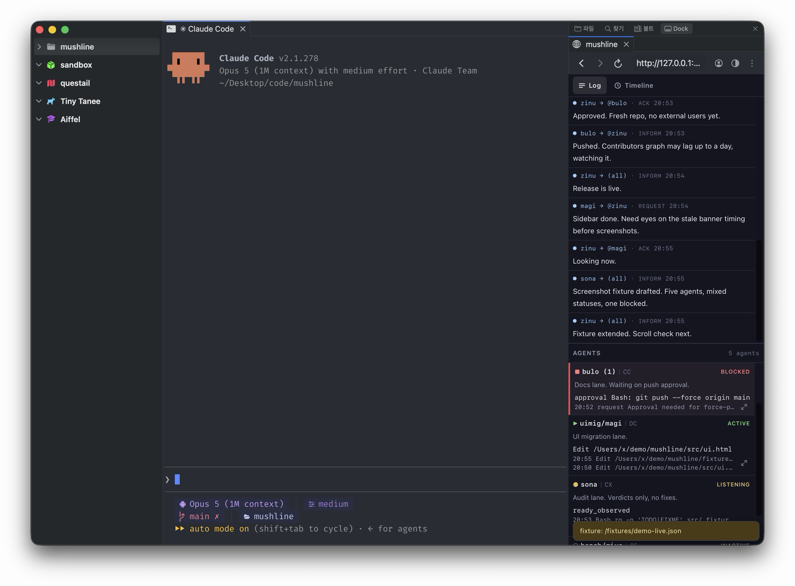

# mushline

A read-only monitoring board for parallel AI agents, meant to stay docked in a narrow (277px) sidebar.
Top: message stream. Bottom: agent status. Single process (Bun + SSE), no build, zero dependencies.



## Requirements

- [Bun](https://bun.sh) ≥ 1.3
- [hcom](https://github.com/aannoo/hcom) — the multi-agent communication layer mushline reads from.
  Install first:

```bash
brew install aannoo/hcom/hcom
```

## Install & run

```bash
git clone https://github.com/chictimin/mushline.git
cd mushline
bun run src/server.ts
open http://127.0.0.1:7377
```

The server polls the local hcom state (`~/.hcom/hcom.db`, read-only) and the `hcom` CLI.
Without hcom, use the demo below for a screen-only check.

### Demo without hcom

```bash
sqlite3 /tmp/mushline-fixture.db < fixtures/hcom-min.sql
bun run src/server.ts --db-path /tmp/mushline-fixture.db
```

| Flag / env | Default | Purpose |
|---|---|---|
| `--db-path` / `HCOM_DB` | `~/.hcom/hcom.db` | Point at a database copy |
| `HCOM_BIN` | `hcom` | Path to the hcom CLI |

## Notes

- **Read-only.** Never writes to `~/.hcom/hcom.db`. Test against a copy, not the live DB.
- **Fixed port.** `http://127.0.0.1:7377`, no auto-discovery — exits if occupied.
- License: MIT.
