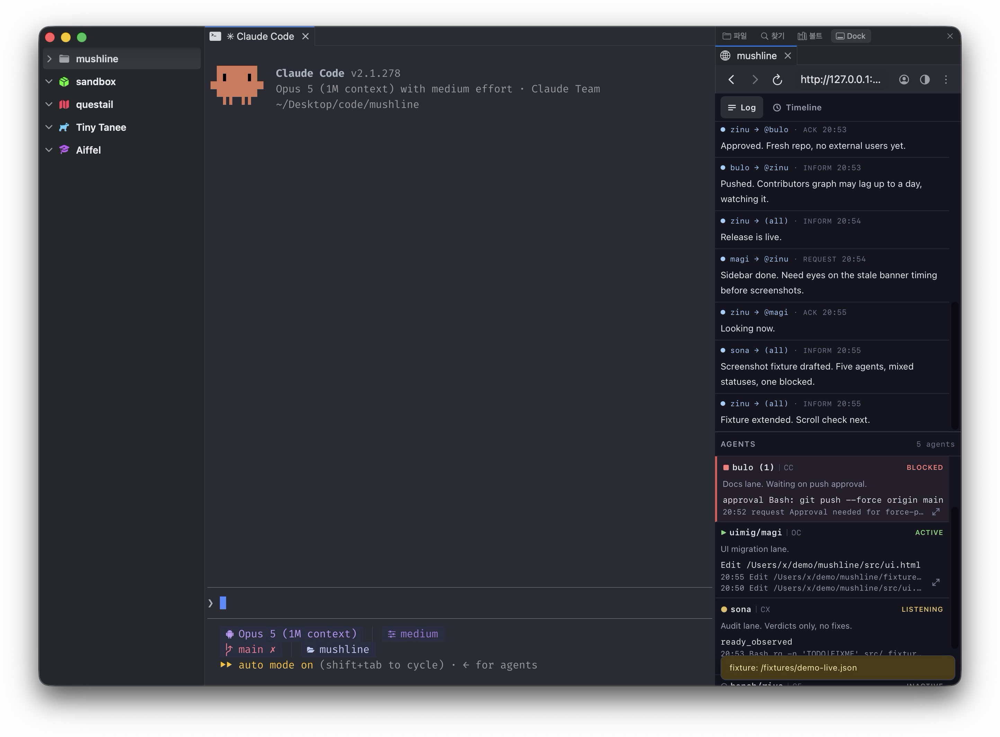

# mushline

English | [한국어](README.ko.md)

A monitoring board for parallel AI agents, meant to stay docked in a narrow (277px) sidebar.
Top: message stream. Bottom: agent status. Single Bun server (Bun + SSE), no build, zero npm dependencies.
Read-only except click-to-focus (cmux focus commands). Requires Bun ≥ 1.3 and the hcom CLI;
it shells out to hcom/cmux subprocesses for polling and focus.



## Requirements

- [Bun](https://bun.sh) ≥ 1.3
- [hcom](https://github.com/aannoo/hcom) — the multi-agent communication layer mushline reads from.
  Install first:

```bash
brew install aannoo/hcom/hcom
```

- `cmux` (optional): workspace-group grouping and name-click focus.
  Without it, grouping falls back to directories and focus is unavailable.
- `sqlite3` CLI (only to seed the demo database below).

## Install & run

```bash
git clone https://github.com/chictimin/mushline.git
cd mushline
bun run src/server.ts
open http://127.0.0.1:7377
```

The server polls the local hcom state (`~/.hcom/hcom.db`, read-only) and the `hcom` CLI.
Without the `hcom` CLI the board still renders from DB instances (CLI failure falls back to the DB);
use the demo below for a screen-only check.

### Demo without hcom

```bash
rm -f /tmp/mushline-fixture.db
sqlite3 /tmp/mushline-fixture.db < fixtures/hcom-min.sql
bun run src/server.ts --db-path /tmp/mushline-fixture.db
```

Delete the temp DB before re-seeding: re-running the `sqlite3` import on the same file duplicates seed rows.

| Flag / env | Default | Purpose |
|---|---|---|
| `--db-path` / `HCOM_DB` | `~/.hcom/hcom.db` | Point at a database copy |
| `HCOM_BIN` | `hcom` | Path to the hcom CLI |
| `CMUX_BIN` | `cmux` | Optional. Groups agents by cmux workspace group (falls back to directory); also provides name-click focus. Without it names are dimmed and `/focus` returns `no_cmux` |

## Terminal support

| Feature | cmux | Other hcom terminals (kitty, WezTerm, tmux, …) | No terminal link (demo DB) |
|---|---|---|---|
| Message stream + agent status | Yes | Yes | Yes (DB rows only) |
| Workspace group filter | cmux workspace group names | Directory fallback | Directory fallback |
| Group sections · Attention · collapse | Yes (browser UI state) | Yes | Yes |
| Name click → terminal focus | Yes — surface-UUID agents land on the exact tab; workspace-UUID (`cmux` preset) agents land on that workspace's focused pane only | No — names dimmed, `/focus` returns `no_cmux` | No |

Terminal focus for other backends (WezTerm backend, Windows Terminal — no list API) is not supported yet.

## Startup history

On launch mushline seeds its buffers from the hcom DB instead of replaying everything:

- **Activity** (Timeline tab, per-agent history): only agents that are currently alive, newest 200.
- **Messages** (Log tab): any message that involves a live agent (sender, `delivered_to` or mentions)
  **or** was sent within the last 24 hours, newest 200.

Events that arrive after startup are streamed as usual. Rendering is batched to one pass per frame,
so the initial backlog no longer triggers a full re-render per event.

## Workspace group filter

The select next to the **Agents** header narrows the whole board to one group:
the agent list, the Log tab and the Timeline tab all follow it. The choice is remembered per browser.

- Agents launched in a **cmux workspace group** are grouped by that group's name
  (the `cmuxtab` preset stores the cmux **surface** UUID in hcom's `launch_context.pane_id`,
  while the `cmux` preset stores the workspace UUID; both forms are resolved through
  `cmux --id-format both tree --all --json` workspaces and their `panes[].surfaces[].id`).
  A surface shared by workspaces in different groups is treated as a shared dock
  and falls back to directory grouping.
  Groups are per cmux window: only the window the server was started from is visible.
- Agents outside a cmux group, or not running in cmux, are grouped by their working directory.
- Each agent card shows its working directory (`~`-shortened), hidden in Compact view.
- A message is shown when its sender or any recipient is in the selected group.
  Broadcasts (no recipients) are shown in every group.
- Agents whose group is unknown (e.g. history from before mushline started) appear only under **All**.

cmux is optional. Without it, grouping falls back to directories.
Name-click focus is unavailable without cmux (names dimmed, `/focus` returns `no_cmux`).

## Agent list

The header reads **Agents (19)**, or **Agents (5/19)** while a group is selected.
The gear button at the right end of the header opens the list settings:

- **Sort** (default on): blocked → pinned → active → listening → unknown → inactive,
  most recent activity first within each. Off keeps the server order with blocked and pinned on top.
  While the pointer or keyboard focus is inside the list, automatic reordering waits;
  status text still updates.
- **Compact** (default off): hides directory, description and history lines.
- **Clear pins**: shown while any agent is pinned.

The pin button on each card keeps that agent near the top and highlights its name
as sender or recipient in the Log tab. Settings and pins are remembered per browser
(pins for agents that disappeared are dropped).

Clicking (or Enter/Space on) an agent's name focuses its cmux terminal
(`focus-window` → `select-workspace` → `focus-pane`, plus `reorder-surface --focus`
only when the target pane holds 2+ surfaces; neighbour `--after`/`--before`, never `--index`).
Tab order is re-verified afterwards; `order_changed` is reported if it moved.
Focus needs `focusable=true` (pane_id seen in the last cmux tree; stale mappings retry once).
An already-active tab costs zero cmux commands; concurrent clicks queue (503 `busy` past 10s).
Failures show a short reason on the card for 2.5s
(`no_cmux`, `not_in_cmux`, `step:<stage>`, `not_selected`, `order_changed`, `busy`).
Agents on the `cmux` preset (workspace UUID) focus to that workspace's focused pane only,
not to a specific tab.
Names dimmed when not running in cmux do nothing.

With All selected and two or more groups, the list splits into labeled sections —
Attention (blocked or pinned) first, then groups A–Z with Ungrouped last.
Attention cards show their group next to the name; blocked cards stop sticking to the top in this mode.
Group headers are color bands (deterministic per-group color, Ungrouped gray, Attention warning tone) and collapse on click or Enter/Space, remembering the folded state per browser; a folded header shows one summary status icon.
Sections need All + two or more groups (Ungrouped counts); with no blocked or pinned agents
there is no Attention section, and a filtered or single-group view stays a plain list.
Sort OFF keeps strict server order inside sections.
Folded headers show one summary icon (active ▶ > listening ● > unknown ◦ > inactive ○).
Attention never folds.

## Notes

- **Mostly read-only.** The hcom DB is opened read-only (`mode=ro`, `readonly: true`);
  only a name click runs cmux focus commands. `/focus` accepts Host `127.0.0.1:7377`
  or `localhost:7377` only, checks Origin when present (absent Origin without cross-site
  `Sec-Fetch-Site` is allowed for local curl), and caps the body at 1024 bytes.
  Test against a copy, not the live DB.
  The focus commands are `focus-window` → `select-workspace` → `focus-pane`,
  plus `reorder-surface --focus` only when the target pane holds 2+ surfaces
  (neighbour `--after`/`--before`, never `--index`).
  Measured with cmux 0.64.25, which has no pure surface-select command
  (hence the `reorder-surface` no-op usage).
- **Fixed port.** `http://127.0.0.1:7377`, no auto-discovery — exits if occupied.
- **Terminal endpoint.** `GET /term/:name?n=20` returns recent terminal lines as JSON
  (404 `not_found`, 503 `unavailable`). No UI caller yet.
- License: MIT.

## Changelog

### 2026-10-07 (group header bands + collapse)

- Section headers became full-width color bands with a 3px group-color bar
  (deterministic per-group color, Ungrouped gray, Attention warning tone).
  Group headers collapse on click or Enter/Space, remember the folded state
  per browser and show one summary status icon while folded; Attention never folds.

### 2026-10-07 (agent group sections)

- With All selected and two or more groups, the agent list splits into labeled
  sections: Attention (blocked or pinned) first, then groups A–Z, Ungrouped last.
  Attention cards carry their group label next to the name; blocked cards are not
  sticky in section mode. Headers show `<label> · <count>`.

### 2026-10-07 (terminal focus)

- Clicking an agent's name focuses its cmux terminal (`POST /focus` with the agent
  name; the server resolves window/workspace/pane/surface from a fresh
  `cmux tree`, runs `focus-window` → `select-workspace` → `focus-pane` →
  `reorder-surface --focus` only when the target pane holds 2+ surfaces,
  with neighbour `--after`/`--before`, never `--index`, then re-reads the tree to confirm).
  Tab order is re-verified afterwards (`order_changed` if it moved).
  Agents not running in cmux show a dimmed name that does nothing; failures show a
  short reason on the card. Local-only: Host/Origin checks on `127.0.0.1`.
  Measured with cmux 0.64.25, which has no pure surface-select command
  (hence the `reorder-surface` no-op usage).

### 2026-10-07

- Group detection follows surface UUIDs (`cmux --id-format both tree --all --json`);
  shared dock surfaces across groups fall back to directory.
  Groups are per cmux window: only the window the server was started from is visible.
  Agents spawned as tabs (`cmuxtab` preset) now join their workspace group in the filter.
- Activity sort (default on), Compact view and Clear pins, behind a gear button in the Agents header.
  Cards are updated in place; pointer or focus inside the list pauses auto-reorder only.
- Pin button (pushpin icon) on each card: pinned agents rank right after blocked
  and their names are highlighted in the Log tab.
- Agent count moved next to the title (`Agents (19)` / `Agents (5/19)`).
  The group select drops its counts, fills the free header width and truncates long names
  (full name on hover).
- Log rows that arrive while the Timeline tab is open are measured on return to Log.
- Demo without hcom no longer crashes: `fixtures/hcom-min.sql` gains `launch_context`,
  and a failing DB fallback keeps the last agent list instead of exiting.
- Test helpers: `fixtures/fake-cmux.sh` + `fixtures/fake-hcom.sh` with
  `fixtures/cmux-case-{match,shared}-{tree,group}.json`
  (`FAKE_CMUX_CASE=match|shared|fail`, `FAKE_HCOM_AGENTS`, `FAKE_CMUX_DIR`).

### 2026-09-29

- Startup seeding limited to live agents (activity) and live-agent-or-last-24h (messages).
- Workspace group filter in the Agents header — cmux workspace groups, directory fallback.
  Applies to agents, Log and Timeline. Agent cards show the working directory.
- Render batching: backlog replay and live events re-render at most once per frame.
- New optional env `CMUX_BIN`.
